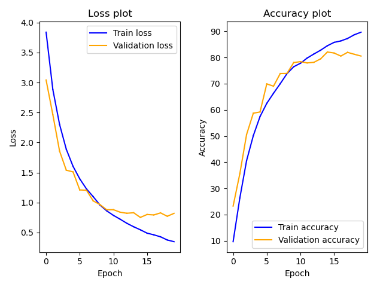
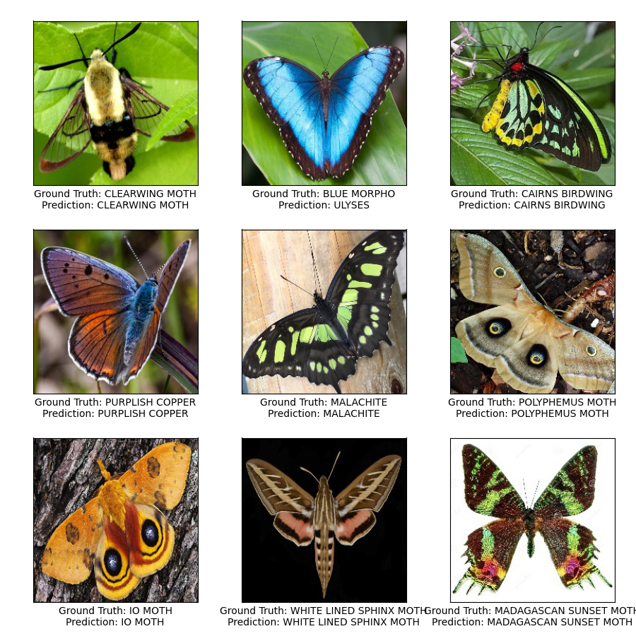

# PyTorch Image Classifier

Perform multi-class image classification using CNNs on PyTorch.

## Highligts

* The model uses 4 CNN layers and 1 Linear layer to classify images of
butterflies and moths.
* The dataset used to train the model can be found
[here](https://www.kaggle.com/datasets/gpiosenka/butterfly-images40-species).
The dataset contains images of butterflies and moths belonging to 100
categories. There are 12k training images, 500 validation images, and 500 test
images, where each image has the dimensions 224x224x3.
* The model achieved 84% test accuracy without any data augmentation.

## Data

* Download the dataset and save it to ./data/ directory.
* To train the model on custom dataset, load the dataset in the following
structure:  
```
├── data
│   ├── train
│   │   ├── label1
│   │   │   ├── *.jpg
│   │   ├── label2
│   │   │   ├── *.jpg
│   ├── valid
│   │   ├── label1
│   │   │   ├── *.jpg
│   │   ├── label2
│   │   │   ├── *.jpg
│   ├── test
│   │   ├── label1
│   │   │   ├── *.jpg
│   │   ├── label2
│   │   │   ├── *.jpg
├── model.py
├── README.md
├── run.py
├── test.py
├── train.py
├── utils.py
└── .gitignore
```

## Train

* To train the model with the default configurations,
run the command:  `python3 run.py`
* To change the epochs, batch size, patience, run the command with necessary
arguments.  
Example: `python3 --epochs=100 --batch_size=128 patience=10`
* To train on a dataset with train, test, valid subdirectories present somewhere
else, use the data_path argument.  
Example: `python3 --data_path="data"`
* After training, the model with best validation loss will be saved as
./checkpoints/best.pt

## Inference

* The model will be tested on the test split of the dataset everytime it is
trained.
* To directly test trained model, use the test argument as:
`python3 run.py --test`
* Sample predictions and loss plots of training are stored in the folder
./outputs/

## Results

*  For the above dataset, the model converged in about 15 epochs giving 84%
accuracy.
* The loss plot during the training phase is as follows:  

* Predictions for some sample images:  
